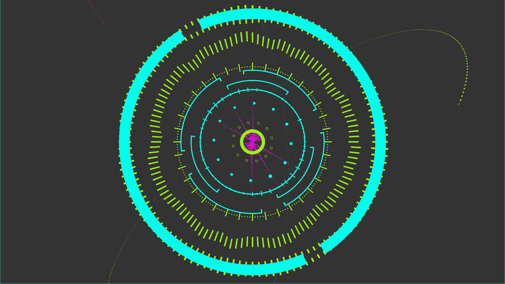

# 2017 ビジュアル情報処理 最終課題レポート

## テーマ:3次元音響ビジュアライザー



### 1. プログラムの利用ドキュメント

#### 1. 起動準備
  
  本プログラムはprocessing IDEからインストール可能な外部ライブラリを使用する。まず、IDEのツールバーより、[スケッチ]→[ライブラリをインポート…]→[ライブラリを追加]と操作し、Contribution Managerウインドウを開く。次に、Filterから検索して、以下のライブラリをインストールする。

* Minim
* PeasyCam

  実行に必要なソースコードは、以下の3つのファイルである。

  * audiovis.pde
  * arcObj.pde
  * arcObjs.pde

#### 2. 音楽ソースの選択

  本プログラムは、音楽ファイルまたはマイク入力の2種類の音源を選択可能である。

##### 音楽ファイルの場合

  音楽ファイルを再生する場合は、以下の手順を行う。

  * スケッチが保存されているディレクトリと同階層に音楽ファイルを設置
  * 10行目`AudioInput in;`をコメントアウト、11行目`AudioPlayer in;`をコメントイン
  * `sketch_15.pde` 63行目の`in = minim.loadFile("./penguin.mp3",1024);`の文字列部分をファイル名(例:  `“./xmas.mp3”` )に変更
  * 62行目をコメントアウト、63,64行目をコメントイン

##### マイク入力の場合

  マイク入力を表示する場合は、 以下の手順を行う。なお、再生デバイスとしてRealtek HD Audioドライバを利用していて、マイク入力にサウンドミキサーを選べる場合、コンピューター上で再生されているすべての音をビジュアライズ可能である。未確認だが、他にもサウンドミキサー機能内蔵のドライバやデバイスであれば同等の事が可能であると考える。

  * 10行目`AudioInput in;`をコメントイン、11行目`AudioPlayer in;`をコメントアウト
  * 62行目をコメントイン、63,64行目をコメントアウト

  例えば、マイク入力の場合以下のようにする。

  ```cpp
  9:  AudioInput in;
  10:  //AudioPlayer in; // 外部音源
  ```

  ```cpp
  58:    in = minim.getLineIn(Minim.STEREO, 1024);  // 内蔵音源
  59:    //in = minim.loadFile("./penguin.mp3",1024); // 外部音源
  60:    //in.loop(); // 外部音源
  ```

#### 3. 起動および操作

  起動すると、図のような画面になる。マウスの左クリックのドラッグ・アンド・ドロップでカメラ回転、右クリックのドラッグ・アンド・ドロップでカメラ移動、スクロールホイールでカメラのズームが可能である。また、再生中の各グラフの表示ゲインはqで増加、eで減少するようになっている。これは音楽ソースによって得られる、異なる音量を適切に表示できるよう手動で補正するために利用する。利用者の好みによって変えるのが適切であるが、例としては本レポート冒頭の画像程度の変化量を挙げておく。

#### 4. 画面上の各表示の説明

  以下の画像を参照。
  

### 2. 工夫点

  本ビジュアライザーの主な特徴は｢3Dかつ操作可能｣｢デザイン重視｣である点である。
  今回は音楽を目で見て楽しむというコンセプトで勉強を行った。また、過去に2Dで音楽のスペクトル表示などは試した経験があるため、3D空間に表示することを目標とした。音楽のビジュアライザーというのは過去に数多のプログラムが生み出されているが、今回は見た目にもこだわることでより視覚的に楽しめるプログラムを目指した。
  加えて、環境が限定されるが、｢コンピューター上で再生されている音すべてを可視化できる｣というのもひとつの目標であった。他の音楽再生ソフトや動画再生等においても可視化を楽しむためには本機能は不可欠であり、今回は特定ドライバを搭載している環境でのみ実現可能となった。

### 3. 勉強点

  音楽関係の機能の大部分を外部ライブラリであるminimに依存しているため、このライブラリのドキュメントを読み、適宜実装する点が第一の学習点である。次に、いかに聴こえる音と表示を組み合わせるかという点について、単純にフーリエ変換した結果以外の情報が使えないか調べたが、心理音響解析の分野になり到底この課題で実装できるものではなかったため、高度な情報処理を実装するには至らなかった。

### 4. 技術的ポイント

実装上の特徴としては、表示オブジェクトのクラス化と一元管理である。これは｢木、家、車を表示せよ｣という課題で利用したものを流用している。3D空間上のオブジェクトは必ず座標や大きさを持っているため、これらをコントロールするメソッドを要したクラス`arcObj`を定義することでオブジェの配置を行いやすくしている。加えて、このクラスに描画用のメソッド`void draw();`を用意し、クラスの配列`ArrayList<arcObj> sceneObj = new ArrayList<arcObj>();`を要してfor文で描画することで、描画のためのプログラム変更箇所を少なくしている。以下は複数配置したときのfor文の例である。

```java
  for (arcObj ao : sceneObj) { 
    pushMatrix();
      ao.draw();
    popMatrix();
  }
```

そして、何個も同じ円弧を描画するため、この円弧に関しては比較的簡単に描画できるように、インスタンス化時に描画のアルゴリズム部分のみをオーバーライドするようにしている。以下がそのコードである。

```java
arcObj arc_time = new arcObj() {
  @Override
  void process(int i, int end) {
      dist = 100 +  volume*300*in.mix.get((int)( i/(float)end * in.bufferSize()));
      leng = 5;
  }
};
```

この関数 `void process(int i, int end);` の引数は、`end`中`i`番目の部分の処理という意味で、例えば一周描画するとき、`end`は`360`として別の部分で設定しておくと`i`は`0~359`の値で実行され、`i`あたり1度の区間の描画を行う。`i`番目の区間ごとに部分円弧の直径や線幅を変えることで、様々な円弧表現を可能としている。

### 参考文献

 1. Minim http://code.compartmental.net/minim/index.html
 2. 音質評価とは - 小野測器 https://www.onosokki.co.jp/HP-WK/c_support/newreport/soundquality/index.htm#menu

